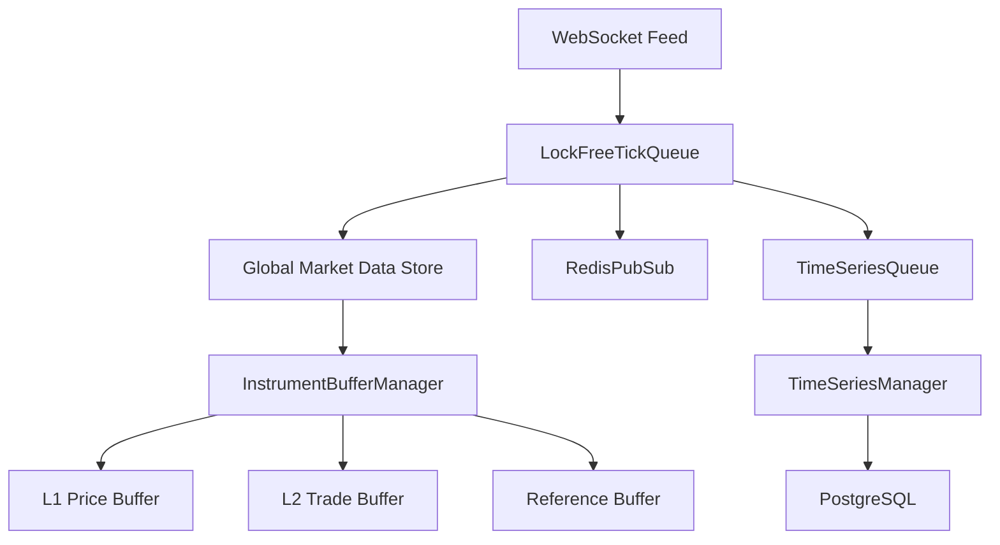
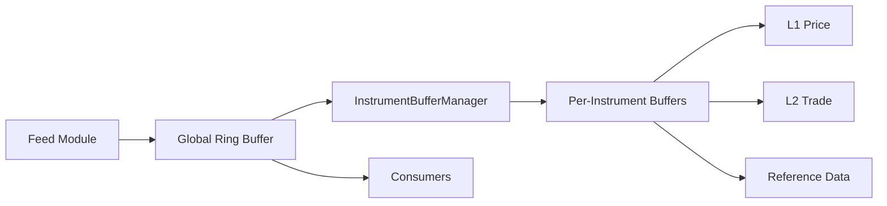

# Ultra-Low Latency Market Data System Architecture

## System Overview

The system combines the high-performance buffer management from src3 with a new feed module in src4 to create a complete market data distribution system. The architecture is designed for ultra-low latency with zero-copy operations and lock-free data structures.

## Core Components Integration

### 1. Global Market Data Store (src4)


### 2. Buffer System Integration (src3 + src4)



## Key Components

### 1. Global Market Data Store
- **Location**: `src4/store/global_market_data.rs`
- **Purpose**: Central repository for real-time market data
- **Features**:
  - Lock-free concurrent access
  - Zero-copy data distribution
  - Direct memory mapping
  - NUMA-aware allocation

### 2. Feed Module
- **Location**: `src4/feed/mod.rs`
- **Components**:
  - WebSocket handler
  - Feed normalizer
  - Message router
  - Rate limiter

### 3. Buffer Management (from src3)
- **Location**: Integrated from `src3/memory/instrument_buffer.rs`
- **Features**:
  - Per-instrument ring buffers
  - Cache-line aligned structures
  - Zero-allocation updates

### 4. Time Series Management
- **Location**: `src4/timeseries/mod.rs`
- **Features**:
  - Efficient compression
  - Automatic partitioning
  - Background persistence

## Integration Points

### 1. Data Flow
```rust
// Key interfaces between src3 and src4
pub trait MarketDataHandler {
    fn handle_tick(&self, tick: MarketDataRecord) -> Result<(), Error>;
    fn get_latest_tick(&self, token: u32) -> Option<MarketDataRecord>;
    fn subscribe(&self, token: u32, callback: Box<dyn Fn(MarketDataRecord)>);
}

pub trait FeedHandler {
    fn process_feed_message(&self, msg: FeedMessage) -> Result<(), Error>;
    fn get_feed_status(&self) -> FeedStatus;
}
```

### 2. Memory Management
- Zero-copy passing of data between feed and buffer systems
- Shared memory pools for efficient allocation
- Cache-friendly data structures

## Performance Considerations

### 1. Latency Optimization
- Direct memory access paths
- Minimized context switches
- Hardware timestamp synchronization
- CPU core pinning

### 2. Throughput Optimization
- Batch processing capabilities
- Multi-threaded feed handling
- Efficient message routing
- Background persistence

### 3. Resource Management
- Memory-mapped files
- Pre-allocated buffers
- Thread pool management
- Connection pooling

## Configuration

```toml
[global]
num_instruments = 10000
cache_size_mb = 1024
num_threads = 16

[feed]
websocket_port = 8080
max_connections = 1000
batch_size = 100
buffer_size = 1048576

[buffers]
l1_size = 1048576
l2_size = 524288
ref_size = 65536

[timeseries]
partition_size_mb = 256
compression_level = "high"
cleanup_interval_sec = 3600
```

## Usage Example

```rust
// Initialize the combined system
let config = SystemConfig::from_file("config.toml");
let market_data = GlobalMarketData::new(config);

// Start the feed handler
let feed_handler = FeedHandler::new(market_data.clone());
feed_handler.start();

// Access market data from any component
let token_id = 1001;
if let Some(tick) = market_data.get_latest_tick(token_id) {
    println!("Latest price: {}", tick.last_price);
}

// Subscribe to updates
market_data.subscribe(token_id, Box::new(|tick| {
    println!("New tick: {}", tick.last_price);
}));
```

## Directory Structure

```
src4/
├── feed/
│   ├── mod.rs
│   ├── websocket.rs
│   ├── normalizer.rs
│   └── router.rs
├── store/
│   ├── mod.rs
│   ├── global_market_data.rs
│   └── snapshot.rs
├── timeseries/
│   ├── mod.rs
│   ├── manager.rs
│   └── compression.rs
└── lib.rs
```

## Next Steps

1. Implement the Global Market Data Store
2. Create the Feed Module
3. Integrate src3's Buffer System
4. Add Time Series Management
5. Implement WebSocket Handlers
6. Add Monitoring and Statistics
7. Create Configuration Management
8. Implement Error Handling
9. Add Testing Framework
10. Create Documentation 